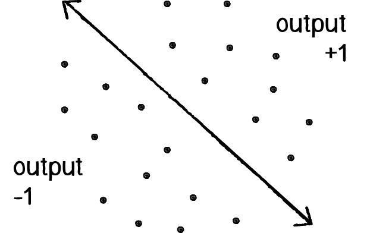
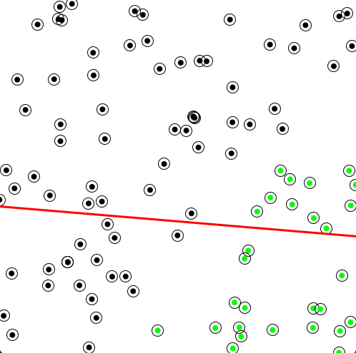
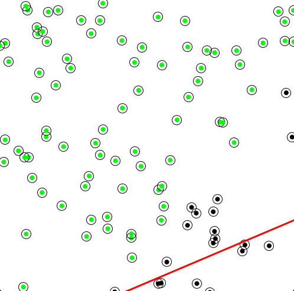

## Perceptron Machine Learning Project

The human brain can be described as a biological neural network—an interconnected web
of neurons transmitting elaborate patterns of electrical signals. Dendrites receive input
signals and, based on those inputs, fire an output signal via an axon. Or something like that.
How the human brain actually works is an elaborate and complex mystery, we will attempt to write very simplistic code that will allow us to simulate a single neuron called a Perceptron in Java.

### The Perceptron
Invented in 1957 by Frank Rosenblatt at the Cornell Aeronautical Laboratory, a perceptron is
the simplest neural network possible: a computational model of a single neuron. A
perceptron consists of one or more inputs, a processor, and a single output.


A perceptron follows the “feed-forward” model, meaning inputs are sent into the neuron,
are processed, and result in an output. In the diagram above, this means the network (one
neuron) reads from left to right: inputs come in, output goes out.
Let’s follow each of these steps in more detail.

1. Receive Inputs

    Consider a perceptron with two inputs—let’s call them x1 and x2.
    ```
    Input 0: x1 = 12
    Input 1: x2 = 4
    ```
1. Assign Weight to Inputs
    ```
    Weight 0: 0.5
    Weight 1: -1
    Input 0 * Weight 0 ⇒ 12 * 0.5 = 6
    Input 1 * Weight 1 ⇒ 4 * -1 = -4
    ```
1. Sum the Weighted Inputs
    ```
    Sum = 6 + -4 = 2
    ```
1. Generate the Output

    The output of a perceptron is generated by passing that sum through an activation function. In
    the case of a simple binary output, the activation function is what tells the perceptron whether
    to “fire” or not. You can envision an LED connected to the output signal: if it fires, the light
    goes on; if not, it stays off.
    
    Activation functions can get a little bit hairy. If you start reading one of those artificial
    intelligence textbooks looking for more info about activation functions, you may soon find
    yourself reaching for a calculus textbook. However, with our friend the simple perceptron,
    we’re going to do something really easy. Let’s make the activation function the sign of the
    sum. In other words, if the sum is a positive number, the output is 1; if it is negative, the output
    is -1.
    ```
    Output = activate(sum) ⇒ activate(2) ⇒ +1
    ```

## Simple Classification Example in Java using the Perceptron Model

Now that we understand the computational process of a perceptron, we can look at an
example of one in action. We stated that neural networks are often used for pattern
recognition applications, such as facial recognition. Even simple perceptrons can
demonstrate the basics of classification, as in the following example.


Consider a line in two-dimensional space.
Points in that space can be classified as
living on either one side of the line or the
other. While this is a somewhat silly example
(since there is clearly no need for a neural
network; we can determine on which side a
point lies with some simple algebra), it
shows how a perceptron can be trained to
recognize points on one side versus
another.

Let’s say a perceptron has 2 inputs (the xand
y-coordinates of a point). Using a sign activation function, the output will either be -1 or
1—i.e., the input data is classified according to the sign of the output. In the above diagram,
we can see how each point is either below the line (-1) or above (+1).

The perceptron itself can be diagrammed as before:


We can see how there are two inputs (x and y), a weight for each input (weightx and weighty),
as well as a processing neuron that generates the output.
There is a pretty significant problem here, however. Let’s consider the point (0,0). What if we
send this point into the perceptron as its input: x = 0 and y = 0? What will the sum of its
weighted inputs be? No matter what the weights are, the sum will always be 0! But this can’t
be right—after all, the point (0,0) could certainly be above or below various lines in our twodimensional
world.
To avoid this dilemma, our perceptron will require a third input, typically referred to as a bias
input. A bias input always has the value of 1 and is also weighted. Here is our perceptron with
the addition of the bias:


The output is the sum of the above three values, 0 plus 0 plus the bias’s weight. Therefore,
the bias, on its own, answers the question as to where (0,0) is in relation to the line. If the
bias’s weight is positive, (0,0) is above the line; negative, it is below. It “biases” the
perceptron’s understanding of the line’s position relative to (0,0).

## Write code in proicessing for the Perceptron
We’re now ready to assemble the code for a Perceptron class. The only data the
perceptron needs to track are the input weights, and we could use an array of floats to store
these.
```
class Perceptron {
    float[] weights;
```
The constructor could receive an argument indicating the number of inputs (in this case
three: x, y, and a bias) and size the array accordingly.

```
    Perceptron(int n) {
        weights = new float[n];
        for (int i = 0; i < weights.length; i++) {
            # The weights are picked randomly to begin with
            weights[i] = random(-1,1); 
        }
    }

```

A perceptron needs to be able to receive inputs and generate an output. We can package
these requirements into a function called feedforward(). In this example, we’ll have the perceptron receive its inputs as an array (which should be the same length as the array of
weights) and return the output as an integer. But, before you return the output, you need to send it through the sign activation function described previosly whose result is the sign of the sum, -1 or +1. Here
the perceptron is making a guess. Is it on
one side of the line or the other?
```
    int feedforward(float[] inputs) {
        float sum = 0;
        for (int i = 0; i < weights.length; i++) {
            sum += inputs[i]*weights[i];
        }
        return activate(sum);
    }
}
```

You should now be able to create a Perceptron object and ask it to make a guess for any
given point. 


```
Perceptron p = new Perceptron(3); #Create the Perceptron.
float[] point = {50,-12,1}; #The input is 3 values: x,y and bias.
int result = p.feedforward(point); The answer!
```
## Your Tasks this week!
1. Create a new Processing sketch - call it ``neuron_classifier``
1. Add code above to the ``Perceptron`` tab and the main ``neuron_classifier`` tab
1. You will need to develop the sign activation function activate() described previously and add it to the Perceptron class.

1. Write code to create a class Point in the ``Point`` tab which has 2 float members x, y. Write 2 overloaded constructors 
    - an no-arg one which will initiallize members x, y to random values between -1 and 1.
    - one with args for initializing x, y to specified values between -1 and 1.

1. I have written the main tab including a function ``line_func`` which returns the ``y`` value of a random equation of a line $$y=slope * x + off $$  The main tab also includes coordinate transformatios for handling the origin (0,0) being at the center of the canvas and x values -0.5 to 0.5 and y values from -0.5 to 0.5.  I will walkthrough this with you if you do not understand it.
    ```
    int nwt = 3;
    int npts = 100;
    Perceptron pcp = new Perceptron(nwt);
    Point [] pts = new Point [npts];
    float slope = (float) (Math.random()) -0.5;
    float off = (float) (Math.random()) -0.5;
    void setup() {
    size(500,500);

    for (int i = 0; i < pts.length; i++) {
        pts[i] = new Point();
    }
    
    pcp.feedforward(pcp.weights);
    }

    float line_func(float x) {
    //y = slope * x + off
    return slope * x + off;
    }

    float px(float x) {
    return map(x, -0.5, 0.5, 0, width);
    }

    float py(float y) {
    return map(y, -0.5, 0.5, height, 0);
    }

    void draw() {
    background(255);
    stroke(0);
    line(px(-1),py(line_func(-1)),px(1),py(line_func(1)));
    for (Point pt : pts) {
        ellipse(px(pt.x), py(pt.y), 16, 16);
    }
    }
    ```


1. Test your code with an array of Point objects.  The output of 2 runs should look similar to this.  
    
    

## WE HAVE NOW CONCLUDED PART 1 OF YOUR FINAL PROJECT!!