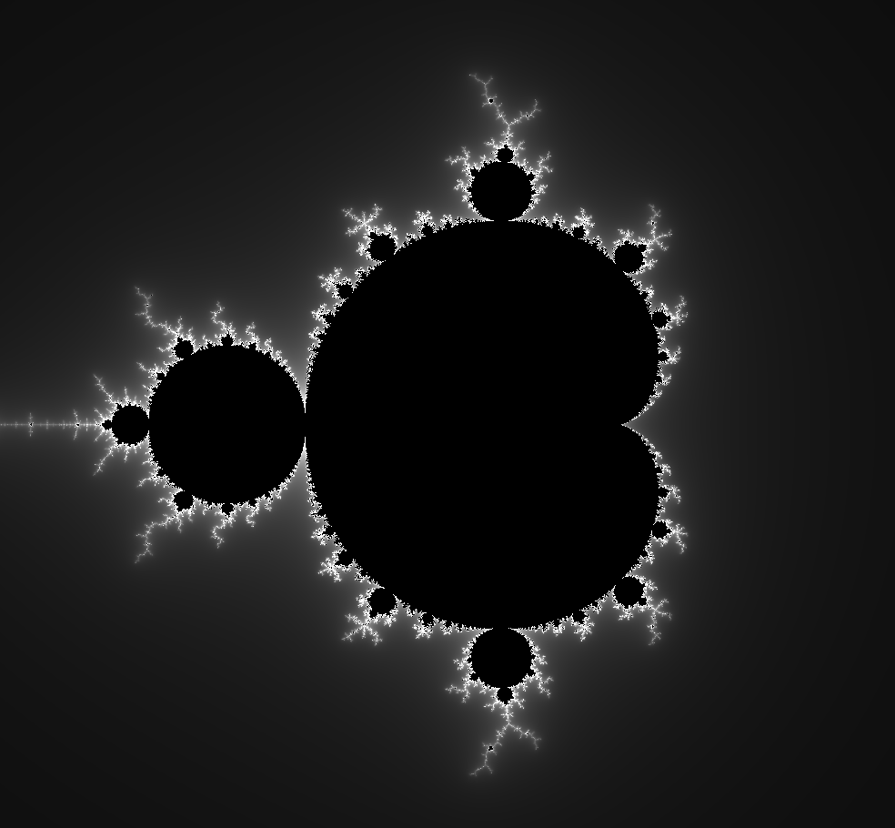
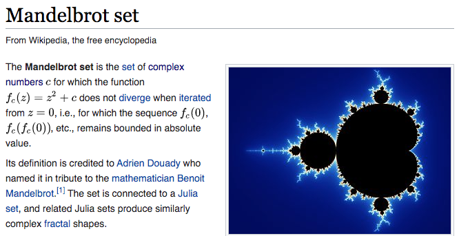
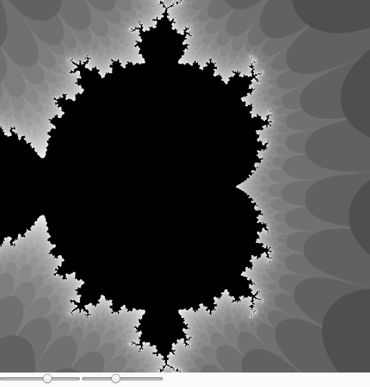

## Mandelbrot Set and Complex Numbers
[Exploring the Mandelbrot Set](http://math.hws.edu/eck/js/mandelbrot/MB.html)


[Wikipedia Entry for a Mandelbrot Set](https://en.wikipedia.org/wiki/Mandelbrot_set)


[Wikipedia Entry for Complex Number](https://en.wikipedia.org/wiki/Complex_number)


## Code Extracts
Set each pixel to a uniform gray scale or some color in your canvas
using  your [color slider example](../../week12/code/colorSlider)
````
function setup() {
  createCanvas(600, 600);
  pixelDensity(1);
}

function draw() {
  loadPixels();
  
  for (let x = 0; x < width; x++) {
    for (let y = 0; y < height; y++) {
      let pix = (x + y * width) * 4;
      pixels[pix + 0] = 51;
      pixels[pix + 1] = 51;
      pixels[pix + 2] = 51;
      pixels[pix + 3] = 255;
    }
  }
  updatePixels();  
}
````

Second stage extract for the Mandelbrot set [See it working here](../code/mbset_v2)
````
let maxgen = 20       //max generations for each complex num to determine if it is does not explode
let infin = 20;

function setup() {
  createCanvas(600, 600);
  pixelDensity(1);

}

function draw() {
  loadPixels();
                                              //Loop through the 2D canvas of pixels
                                              //x is real axis y is imaginary axis
  for (let x = 0; x < width; x++) {
    for (let y = 0; y < height; y++) {
                                              //Map each pixel or complex nums (c) to be within a 
                                              //small range of -ve to +ve integers for 
                                              //the real and complex components
                                              // c = a + bi
      let a  // ??   map()something
      let b  // ??   map()something
                                              
      let ainit = a; //store initial value of real component of 'c' 
      let binit = b; //store initial value of compl component of 'c'

      let n = 0;     //iteration index for each cno to determine if it is does not explode

      while (n < maxgen) {      
                                // calculate each new generation 'z' real and imaginary components
        let asq                 //  = ??
        let bsq                 //  = ??
        let tab                 //  = ??
                               // generate each generation 'z' of the complex number 
                               // variant z = z^2 + c and add the original  complex number 'c'
        
        a  =                    //= ?? getting new value of z's real component
        b  =                    //= ?? getting new value of z's compl component

        if (abs(a + b) > infin) { // break here when the new number z starts to explode (infin)
          break;
        }

        n++;  // store the value of the nth iteration when it exploded (reached infin) 
      }

      let pvalue = 0;
      if (n === maxgen) {       // did we reach max gen - probably a STABLE set which will not explode
        pvalue = 255;
      }
                                // if pvalue is still zero at this stage the complex number did explode 
                                // before reachng the maximum geneations  - probably NOT STABLE
                                // accordingly set the pixel values
      let pix = (x + y * width) * 4;
      pixels[pix + 0] = pvalue;
      pixels[pix + 1] = pvalue;
      pixels[pix + 2] = pvalue;
      pixels[pix + 3] = 255;
    }
  }
  updatePixels();  
}
```` 

A [final working example with sliders](../code/mbset_v5) for minimum and maximum values for complex plane. Code can be seen on [Slack #stdteam and #advtean channels](https://app.slack.com/client/TTS9Y46VC).

